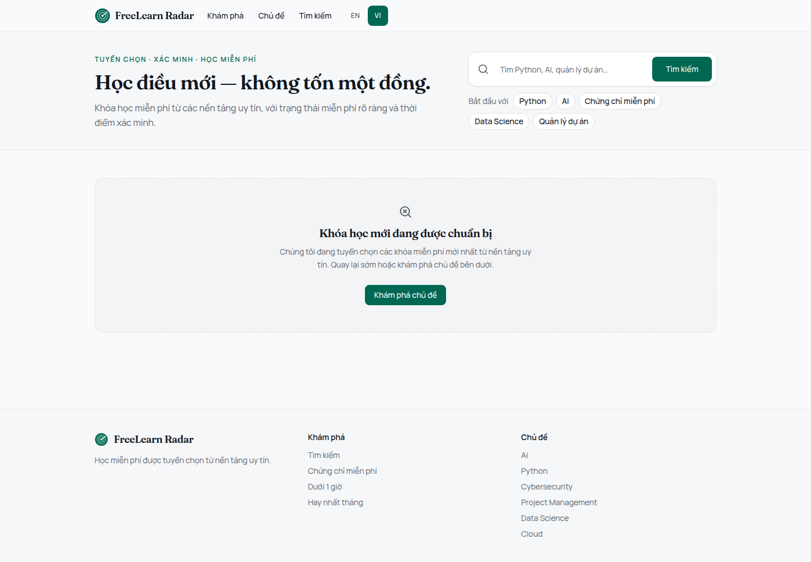
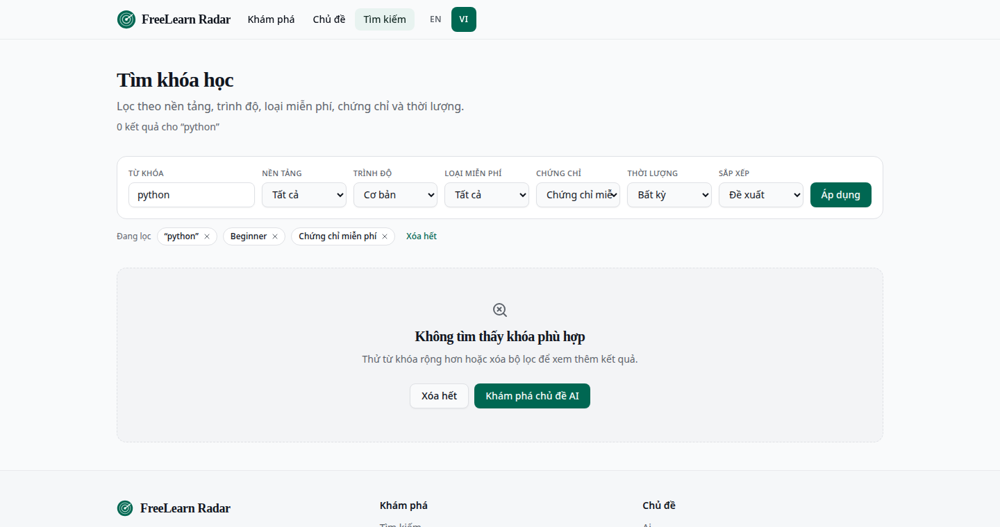
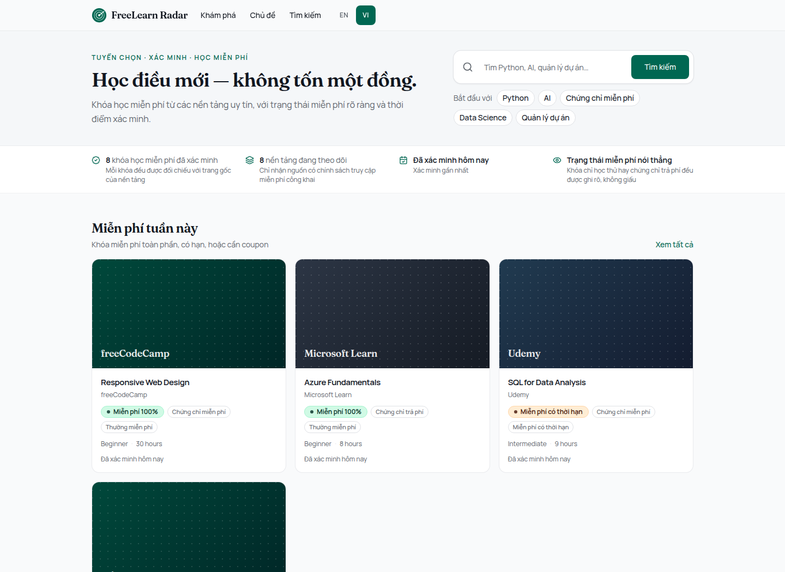

# UI/UX Polish — Public Discovery + Admin Operations Console

Visual direction taken from `docs/ui-reference/freelearn-v13-ui-reference.png`.
Layout, density, and hierarchy only — no data, count, rating, or status in the
reference was copied. Every figure rendered comes from the application.

**Quality gates:** lint PASS (2 pre-existing warnings, unchanged) · typecheck
PASS · test PASS (370, up from 367) · build PASS.

Nothing was committed, pushed, or deployed.

---

## The bug that only running the app could find

`dict.filters` is passed whole from server components into the
`CatalogFiltersForm` client component. I added an active-filter chip label as a
function — `removeFilter: (label) => …` — which is valid TypeScript, passes
typecheck, and builds successfully. At runtime React cannot serialise a function
across the server/client boundary, so **every page carrying filters returned
500**: search, category, provider, collections, free-certificate, free-courses.

It is now a `{label}` template string, interpolated client-side, matching the
convention already used in the admin dictionary.

A regression test in `src/test/m18-4-translation-completeness.test.ts` asserts
that every value in a dictionary slice passed to a client component is
serialisable, and names the fix in the failure message.

---

## Design system

Tailwind v4, CSS-first theme in `src/app/globals.css`. No parallel system was
introduced; the existing emerald/teal brand, Fraunces display serif, and Manrope
sans are unchanged.

**Added — status semantics.** `--success`, `--warning`, `--info` and a
`--destructive-surface`, each with a saturated colour for icons/text and a
low-chroma surface for fills. Shared by public badges and the admin console so a
warning means and looks the same on both sides.

**Added — course tile tones.** Five deep, brand-adjacent tones as CSS component
classes (`.course-tile-1` … `-5`) rather than arbitrary values scattered through
components.

**New primitives.**

| File | Purpose |
|---|---|
| `src/components/ui/badge.tsx` | Seven semantic variants, two sizes. The codebase had no badge primitive. |
| `src/components/ui/status-badge.tsx` | Icon + label + colour together. Status never relies on colour alone. |
| `src/components/public/breadcrumb.tsx` | Replaces four slightly different hand-rolled breadcrumbs. |
| `src/components/public/course-grid.tsx` | The single grid every catalogue surface now uses. |

---

## Course card

The highest-priority item, and the one that changed most.

**The purple was Udemy.** `course-visual.ts` mapped tones to provider slugs, with
`udemy → bg-violet-950` and `data-science → bg-violet-900`. On a catalogue where
Udemy is a major source, that made a wall of saturated violet the dominant visual
element. Tone is now a hash of the course slug across one curated set — pure, so
a course keeps its tile between renders and between server and client.

**Broken images no longer show.** The visual is a client component; a remote
provider image that 404s, expires, or blocks hotlinking silently falls back to
the tile. Previously a dead URL rendered the browser's broken-image icon.

**Layout follows the reference**: full-bleed 16:9 visual with a provider pill
overlaid, then title, provider, truth badges, level · duration, and verification
freshness pinned to the bottom so the line aligns across a row.

**Density.** The full-width CTA button and the two-line description were removed;
the whole card is the link. The title anchor is stretched over the card and the
provider link lifted above it, giving one tab stop per card while keeping the
provider reachable — nesting two anchors would not.

**No ratings were added.** The reference shows stars; the product has no
legitimate rating source, so the mockup was not followed here.

**Grid.** `auto-fill` with a `17rem` minimum: four columns at full width, two on
tablet, one on mobile. It also fixes the low-data case — empty tracks stay empty,
so a catalogue holding one course renders one correctly-sized card instead of
stretching it across the page.

---

## Public pages

**Homepage.** Hero tightened so the first screen reaches the catalogue rather
than ending at a headline; the search field now carries the focus ring as one
unit and reads as the primary action.

The topic shortcuts were labelled *Trending / Xu hướng*. They are a hardcoded
curated list and the product measures no popularity, so the label is now
*Start with / Bắt đầu với*. The key was renamed `topicShortcuts` to stop the
claim reappearing.

Section order follows the brief: free this week → best → recently verified →
browse by topic → certificates → short → providers → monthly.

Category browse became a wrapping tile grid; the previous horizontal scroll rail
hid most topics on exactly the screens where browsing matters. No per-category
counts — an accurate one costs a query each.

**Trust strip (new).** Verified course count, providers tracked, and last
verification time, backed by `getCatalogTrustSignals` — one aggregate over
published, free-eligible courses. Computing it from the loaded page of courses
would have understated both figures. **Each item renders only when a real value
exists**, and the strip disappears entirely when nothing is known, which is what
the screenshot below shows.

**Search and catalogue.** The filter form was an admin-style grid of labelled
selects. It is now a compact single-row toolbar with small uppercase labels,
collapsing to a drawer on mobile. All seven filters and sort are preserved.

Active filters appear as chips with individual remove links plus *clear all*,
placed outside the collapsible panel so a narrowed result set still explains
itself on mobile.

Zero results now offers *clear filters* as a secondary action, shown only when a
filter is what emptied the page.

**Course detail.** The page had no course image at all; the visual now sits in
the sticky action panel, beside "view this course", rather than above the `h1` —
keeping the course title the page's first landmark.

**Vietnamese truth labels fixed.** `FREE_AUDIT` read *"Học thử miễn phí"* and
`FREE_TRIAL` read *"Dùng thử miễn phí"* — near-identical, for two states that
mean opposite things: audit access does not expire, a trial does, and FREE_TRIAL
is excluded from free listings entirely. They are now *"Học miễn phí"* and
*"Dùng thử có hạn"*, with a test asserting the two labels stay distinct in both
locales. No Truth Engine rule changed; only what the badge says.

The duration filter also always rendered English bucket labels regardless of
locale; it now uses `durationBucketLabel`.

---

## Admin console

**There was no shared chrome.** Every page rebuilt its own header, which is why
only the dashboard ever showed the role badge, language switcher, and sign-out.

`src/app/admin/layout.tsx` now wraps every authenticated route in `AdminShell`:
sticky topbar plus a sidebar rail from `lg` up, becoming a drawer below that
rather than a squeezed column. The login page has no session and so gets no
chrome. Navigation lists **existing routes only** — nothing from the reference
was added speculatively, and `Users` appears only for ADMIN.

Twelve pages were converted to render content only, using a shared
`AdminPageHeader`. Tables gained `scope="col"`, sr-only captions, and
`whitespace-nowrap` on narrow columns; bare status strings became badges. No RBAC
check, data fetch, or business behaviour was touched.

**Dashboard** now separates incidents from statistics, which the brief calls for
and which matters because a queue of three candidates and a catalogue of forty
courses are different kinds of number. *Action required* shows only non-zero
items and renders a calm all-clear state otherwise. Catalogue counts sit apart.
Recent activity reads the audit log, which nothing in the UI previously
surfaced.

**Collection page** became an operations console: health first, then run
controls, then history. The order is deliberate — the question an operator opens
this page with is "is it running?", and triggering a batch before knowing that is
how you hit a provider that is already failing.

### Health is derived, never assumed

`src/domain/admin/operations-snapshot.ts` computes health only from signals the
system actually records:

| Subsystem | Real signal |
|---|---|
| Discovery | Latest `DISCOVERY_RUN` audit row: timestamp and recorded error count |
| Verification | `max(courses.last_verified_at)` over published courses |
| Monitor / cron | Latest `api_usage_log` row with `kind = 'monitor_fetch'` |
| Query scheduling | `discovery_queries` enabled and due counts |

`unknown` is a first-class outcome. §32 forbids reporting healthy merely because
nothing visibly failed, so a subsystem with no recorded success signal reports
Unknown permanently — which is the honest answer and also the pressure to add
one. Staleness thresholds: 48 hours for discovery and monitor, 7 days for
verification.

**Tavily and NVIDIA are deliberately absent from the health panel.** Neither
records a success signal anywhere, so any state shown would be invented. The AI
connection test remains as an on-demand diagnostic.

### Run history without a runs table

There is no `discovery_runs` table. The history is reconstructed from
`admin_audit_log` `DISCOVERY_RUN` entries, and the panel says so rather than
implying a richer source. Two real limits follow: only completed runs appear, and
a run that crashed before writing its audit row is absent entirely. A missing
field renders as `—`, never as `0`, which would read as "found nothing" instead
of "not recorded".

---

## Verification performed

The reference layouts were checked against a running build.

Homepage, empty catalogue, 1440px — hero compact, search dominant, curated topic
chips, trust strip correctly absent because no figure is available:

Search with three active filters, 1440px — single-row toolbar, removable chips,
zero-result state offering both clear-filters and a broader entry point:

Homepage at 390px — hero stacks, search full width, chips wrap, footer stacks:

Two issues were found this way and fixed: the filter toolbar's `xl` grid had
seven tracks for eight items, wrapping the submit button onto its own row; and
the monthly-collection section rendered its heading with nothing beneath it on an
empty catalogue, directly under the empty state that already explained the
situation.

### Verified with data

A local Postgres was later stood up and seeded, which closed this gap. Homepage
with a populated catalogue — real trust figures, provider-toned tiles, no purple
wall:

That run found two defects invisible on an empty catalogue, both now fixed: the
course title rendered **twice** per card (once on the fallback tile, once
beneath it, which read as a rendering fault), and the trust strip's third item
collided two phrases into "Checked today Last checked".

All nine admin routes were exercised with a real session and return 200. The
health panel was confirmed to derive states correctly rather than assume them:
verification reported **Healthy** with a real timestamp, monitor reported
**Unknown — no signal recorded yet**, because nothing writes `api_usage_log` in
a fresh database. That is the behaviour §32 asks for.

### Still not verified visually

Admin pages were checked by markup rather than by eye: the session cookie is
httpOnly, so headless Chrome could not be pointed at an authenticated page.
Layout and density there rest on code review; **the admin console should still be
looked at in a browser.**

---

## Accessibility

- One tab stop per card via a stretched title link; the provider link is lifted
  above the overlay rather than nested inside it.
- Status is icon + text + colour, never colour alone.
- Breadcrumbs are an ordered list with `aria-current="page"` on the final crumb.
- Filter chips carry an accessible name naming the filter they remove.
- Admin nav marks the active item with `aria-current`; the drawer closes on
  Escape and on navigation.
- Tables have `scope="col"` and sr-only captions.
- Touch targets stay at 44px on mobile and tighten only on pointer devices.
- Heading order preserved: the detail-page visual sits in the aside so the
  course title remains the first landmark.
- Existing `prefers-reduced-motion` handling respected; hover transforms are
  disabled under it.

## i18n

Every new string is in both dictionaries. New public keys: `hero.topicShortcuts`,
the `trust` group, `filters.removeFilter`, `a11y.breadcrumb`. New admin keys:
navigation labels, the `health` group, dashboard section headings, and run
history columns. The completeness tests — including the one that catches
untranslated copies — pass.

## Known limitations

1. **No visual check of populated or admin views** (above). The most important
   follow-up.
2. **`next/image` is not used.** Course thumbnails come from arbitrary provider
   domains; adopting it would require an open `remotePatterns` allowlist. Images
   are lazy, `decoding="async"`, in a fixed aspect box so there is no layout
   shift, with the first row eager.
3. **No per-category counts** on topic tiles — one query per category.
4. **Tavily and NVIDIA health cannot be shown** until something records their
   outcomes; extending `api_usage_log` to them is already an open item from the
   v1.2 remediation plan.
5. **Card descriptions were dropped** for density, matching the reference. If
   scanning suffers with real content, a single clamped line is a small revert.
