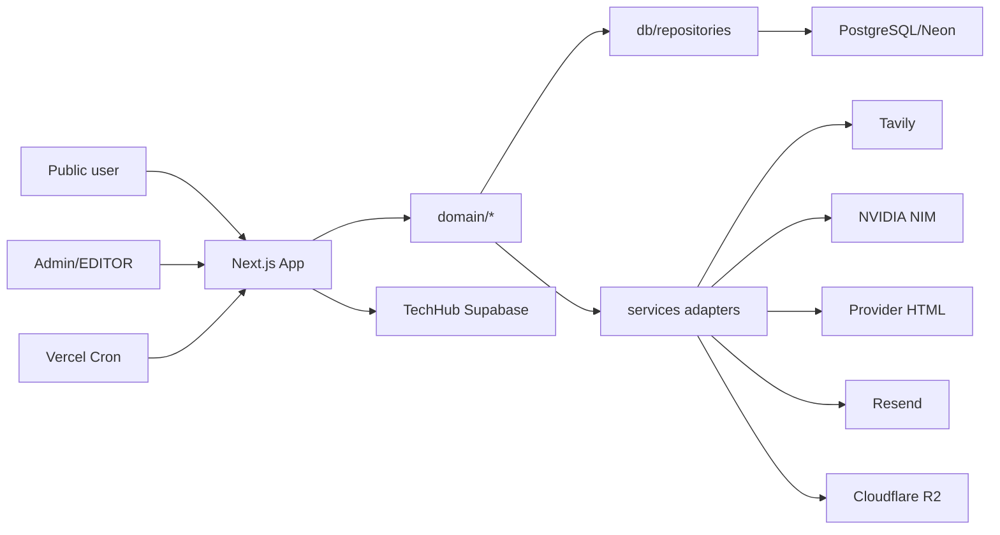
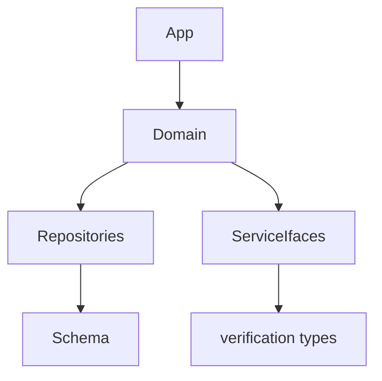

# 01 · Kiến trúc

> **Dự án:** freelearn-radar · **Ngày audit:** 2026-08-21 · **Commit:** `25fa234`
> **Phạm vi:** `src/{app,domain,db,services,lib,config}` · **Pha:** 2/6

## 1. Pattern kiến trúc

**Modular monolith trên Next.js** (App Router = BFF + UI), layered theo convention:

- `src/app` — HTTP/UI
- `src/domain` — use-cases / rules
- `src/db/repositories` — persistence
- `src/services` — ports tới Tavily, NVIDIA, HTTP fetch, Resend, R2, TechHub Supabase

Không DDD thuần, không hexagonal đầy đủ: domain **được phép** phụ thuộc interface trong `services` (AIProvider, SearchProvider) — đúng ý `project-plan.md` “không gọi Tavily/NVIDIA từ business layer” một phần: domain import **type/interface**, factory vẫn ở route/cron (`src/app/api/cron/discover/route.ts:45-63`).

Object storage: adapter R2 nằm trong `src/domain/storage/r2-provider.ts` (SDK AWS), không trong `services/` — lệch nhẹ so với AI/search.

## 2. Sơ đồ tổng thể

## 3. Các module chính

| Module | Vai trò | Phụ thuộc vào | File chính |
|---|---|---|---|
| Discovery | Query Tavily, ingest candidate | search provider, candidate-service | `src/domain/discovery/discovery-engine.ts` |
| Candidate | Fetch source, AI analyze, approve/reject | fetch, AI, course, verification | `src/domain/candidate/*` |
| Verification | Free/cert truth, cron verify | policies, evidence | `src/domain/verification/*` |
| Catalog / ranking | Public lists, scores | course-repository | `src/domain/ranking`, `src/db/repositories/course-repository.ts` |
| Monitor | Observations, price events | fetch, detect-events | `src/domain/monitor/*` |
| Alerts | Watches + email | email provider | `src/domain/alerts/*` |
| Search | Lexical / hybrid / NL | embeddings, pgvector | `src/domain/search/*` |
| Coupon | Discover/verify 100% off | safe-http | `src/domain/coupon/*` |
| Affiliate | Course + commerce placements | flags | `src/domain/affiliate/*` |
| Coverage | Gaps, funnel, plans | catalog metrics | `src/domain/coverage/*` |
| Storage | Managed assets | R2 flags | `src/domain/storage/*` |
| Branding | Site chrome | DB + optional R2 | `src/domain/branding/*` |
| TechHub | Push posts (sản phẩm phụ) | Supabase | `src/services/techhub/*` |

## 4. Sơ đồ dependency giữa module

**Circular nhẹ (suy đoán từ import):** `services/fetch` import `domain/verification` (`course-source-fetcher.ts:3-5`) trong khi `domain/monitor` import fetch — vòng domain ↔ services. Không có `domain → app`.

## 5. Cross-cutting concerns

| Concern | Thư viện / cách | Nơi triển khai |
|---|---|---|
| Config | Zod `getServerEnv()` | `src/lib/env.ts` |
| Logging | JSON stdout | `src/lib/logger.ts` |
| AuthN | jose JWT cookie | `src/lib/auth/session.ts`, `src/middleware.ts` |
| AuthZ | `assertAdmin` / `assertEditor` | `src/lib/auth/rbac.ts` + từng API |
| Rate limit | in-memory Map | `src/lib/rate-limit.ts` |
| Validation | Zod | login, AI schema, env |
| SSRF | allowlist/block private | `src/lib/safe-fetch-url.ts`, `src/services/fetch/safe-http-client.ts` |
| Audit | `writeAuditLog` | `src/domain/admin/audit-log.ts` |
| Feature flags | `process.env.FEATURE_* === "true"` | rải pages/domain; **không** helper trung tâm |
| Cache/ISR | chủ yếu dynamic | branding revalidate `src/domain/branding/revalidate-public.ts` |
| Queue | không | cron đồng bộ `maxDuration = 300` |

## 5b. Frontend Design Inventory

### Nền tảng UI

Tailwind CSS 4 (`src/app/globals.css`), CVA + `cn` (`src/lib/utils.ts`), Radix Slot. Bộ `src/components/ui`: button, input, card, badge, label, skeleton, status-badge. Docs: `docs/DESIGN_SYSTEM.md`, `docs/UI_UX_GUIDELINES.md`.

### Design token

Tokens trong CSS/Tailwind theme (globals). i18n copy tách `src/lib/i18n` (public + admin vi/en). Default locale `vi` (`src/lib/i18n/config.ts:3-7`); language switcher public **tắt**.

### Component lõi tái dùng

| Component | Đường dẫn | Mức dùng | Ghi chú |
|---|---|---|---|
| Button/Input/Card | `src/components/ui/*` | cao | shadcn-like |
| Course grid/card | `src/components/public/course-grid.tsx` | cao | catalog |
| Catalog filters | `src/components/public/catalog-filters.tsx` | 462 dòng | hotspot |
| Page shell | `src/components/layout/page-shell.tsx` | layout public | |
| Admin nav/shell | `src/components/admin/admin-nav.tsx` | admin | 20+ mục nav |

### Mẫu màn hình

| Dạng | Đại diện | Route | File |
|---|---|---|---|
| Home / discovery | Homepage | `/[locale]` | `src/app/[locale]/page.tsx` |
| List/filter | Free courses | `/[locale]/free-courses/[topic]` | `.../free-courses/[topic]/page.tsx` |
| Detail | Course | `/[locale]/course/[slug]` | `.../course/[slug]/page.tsx` (546 dòng) |
| Search | Search | `/[locale]/search` | `.../search/page.tsx` |
| Auth | Admin login | `/admin/login` | `src/app/admin/login/page.tsx` |
| Admin table | Candidates | `/admin/candidates` | `src/app/admin/candidates/page.tsx` |
| Admin form | Course edit | `/admin/courses/[id]` | + `course-form.tsx` 470 dòng |
| Ops dashboard | Coverage | `/admin/coverage` | 578 dòng |

Flag-gated (default ẩn): tracker, compare, path, topic pages, coupon public surface.

### Quy ước hiện hành

- Public: RSC + DB repository; locale prefix bắt buộc via middleware redirect.
- Loading: một số `loading.tsx` (course, best, provider, free-certificate).
- Admin: client forms POST/PATCH JSON API; session cookie.
- Không Redux; state form local; interests dùng localStorage (`src/domain/discovery/interests.ts`).

### Tính nhất quán

- Flag đọc **lặp** `getServerEnv()` vs `process.env` (try/catch trên course page — `src/app/[locale]/course/[slug]/page.tsx:132-229`) để build không vỡ khi env thiếu.
- Homepage nhiều section (M25 nhận định loãng) — rủi ro UI chắp vá nếu bật hết flag.
- Admin nav dài (TechHub, affiliate, embeddings, media-storage) so với user journey public.

## 6. Quy tắc kiến trúc & kiểm tra tuân thủ

### Kiến trúc dự định

Suy ra từ `project-plan.md` §4–5 + cấu trúc thư mục. **Không có ADR kiến trúc tổng** (có `docs/ADR_EMBEDDING_MODEL.md` cho model embed).

### Bảng quy tắc

| # | Quy tắc | Nguồn |
|---|---|---|
| A1 | Domain không import `src/app` | cấu trúc |
| A2 | AI/search gọi qua provider interface | project-plan |
| A3 | Secrets chỉ server (`NEXT_PUBLIC_` cấm secret) | `.env.example`, SECURITY.md |
| A4 | Admin API: middleware + RBAC route | rbac + middleware |
| A5 | Cron fail-closed nếu thiếu `CRON_SECRET` | cron-auth.ts |
| A6 | Feature flag runtime, không bake static | feature-flag-runtime.test.ts |
| A7 | Ranking/search không lấy tín hiệu affiliate | M20.12 docs + comment env |

### Vi phạm phát hiện

| Quy tắc | Vị trí | Mức độ | Gợi ý sửa |
|---|---|---|---|
| A2 lệch | `src/domain/storage/r2-provider.ts` SDK trực tiếp trong domain | Low | chuyển `src/services/storage` |
| Layering | `src/services/fetch/course-source-fetcher.ts:3-5` import domain verification | Low | đẩy classify vào domain, fetch chỉ trả HTML/metadata |
| A6 tuân thủ | test tồn tại | — | giữ trong CI (đã có `npm test`) |
| Không tool ArchUnit | — | — | có thể thêm dependency-cruiser cho A1 |

Không phát hiện `domain → app`.

## 7. Đánh giá

### Điểm mạnh

- Tách bounded context rõ (`discovery`, `verification`, `monitor`, `coupon`, `coverage`).
- Kill-switch flags + cron budget env có upper bound (`env.ts` monitor/coupon).
- SSRF architecture tái dùng (M18.4).
- Truth layer (free lists) được treat như invariant sau remediation v1.2.

### Điểm lệch chuẩn / nợ kiến trúc

- God files: `course-repository.ts:866`, `course/[slug]/page.tsx:546`, `coverage/page.tsx:578`, `approve-candidate.ts:443`.
- Bề mặt sản phẩm (semantic, path, compare, alerts, R2, TechHub) lớn hơn catalog hiện có — M25 đã cảnh báo.
- `api_usage_log` chủ yếu monitor (remediation R3 leftover, `docs/V1_2_REMEDIATION_IMPLEMENTATION.md:199-201`).
- Docs vận hành lệch cron thật.

### Mức tuân thủ tổng thể

**Khá tốt** cho một Next monolith. Nợ chính là **surface area vs operating product**, không phải hỗn loạn layer.
