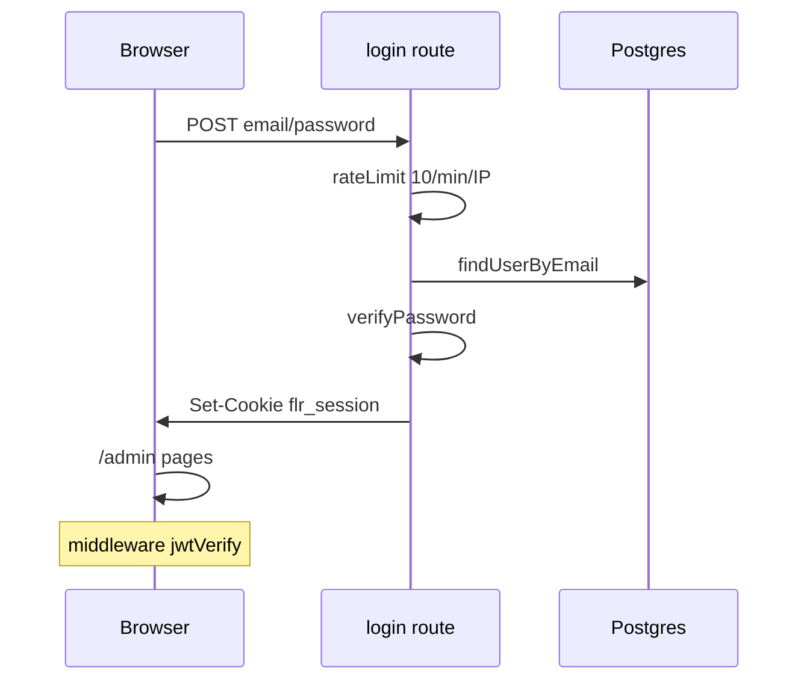
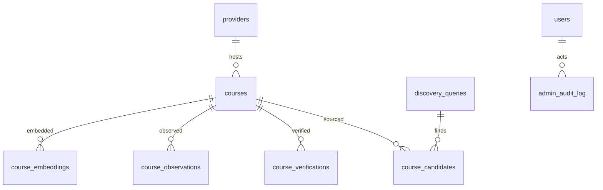
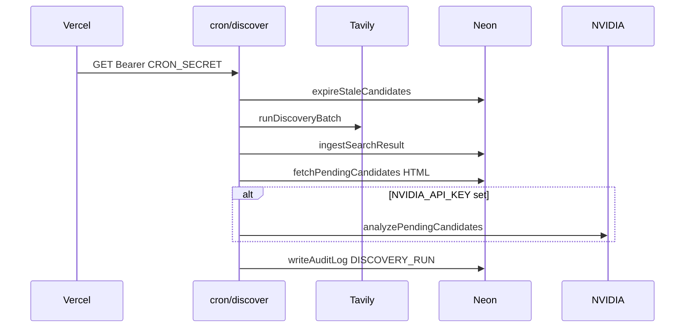
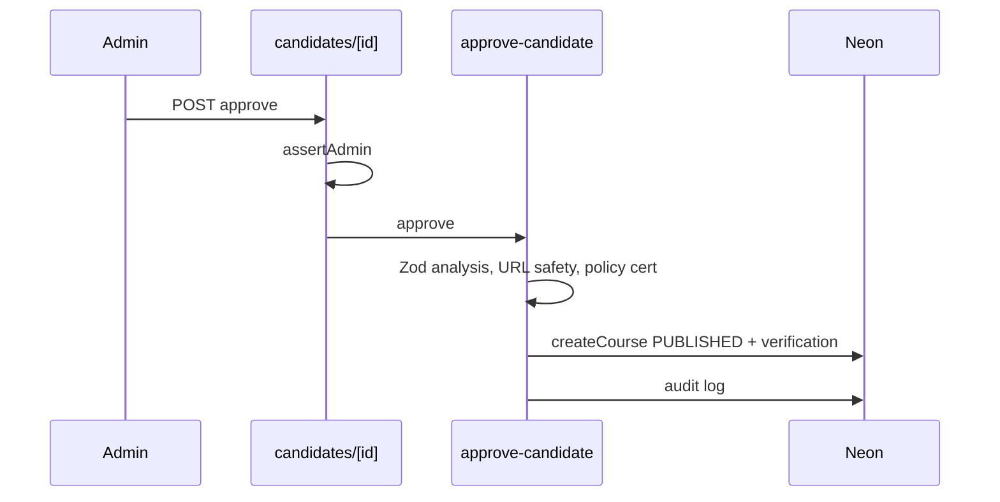
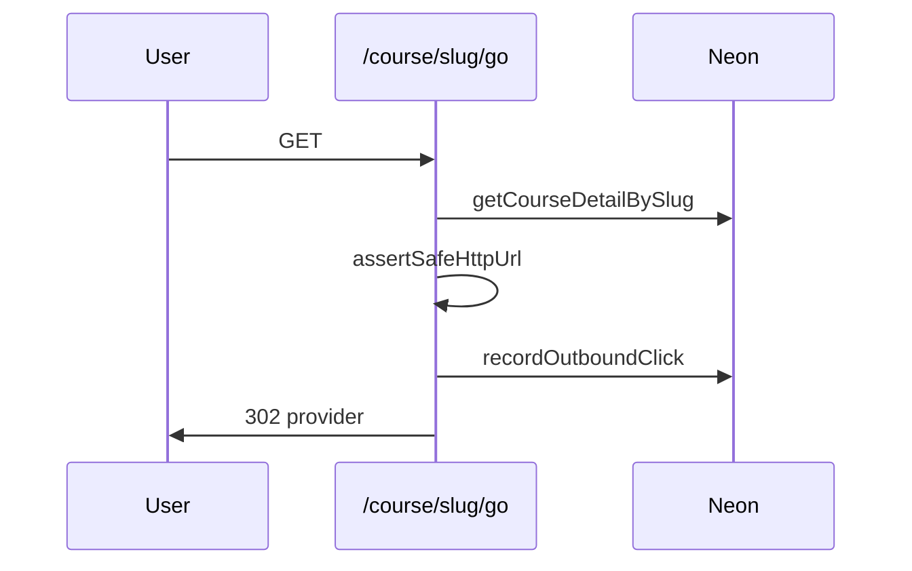

# 02 · API & Luồng dữ liệu

> **Dự án:** freelearn-radar · **Ngày audit:** 2026-08-21 · **Commit:** `25fa234`
> **Pha:** 3/6

## 1. Tổng quan API

REST qua Next.js Route Handlers. Không OpenAPI/Swagger. Không version path (`/v1`).

Đối chiếu số endpoint:

| Cách đếm | Kết quả |
|---|---|
| File `src/app/api/**/route.ts` | 40 |
| `export async function (GET\|POST\|PUT\|PATCH\|DELETE)` trong `src/app/**/route.ts` | **56** |
| Cộng redirect handlers ngoài `/api` | `GET /course/[slug]/go`, `GET /go/affiliate` |

Chênh 40 file vs 56 handlers = nhiều file export GET+POST (cron dual, branding, embeddings, affiliate products, watches unsubscribe, …). Không thấy route đăng ký runtime ngoài App Router.

## 2. Bảng endpoint

Auth: **Public** | **Cron Bearer** | **Cookie session** + RBAC (ADMIN/EDITOR) ở handler.

### Public / health / media

| Method | Path | Handler | Auth | Mô tả |
|---|---|---|---|---|
| GET | `/api/health` | `api/health/route.ts:9` | Public | Liveness; `?deep=1` ping DB |
| GET | `/api/site-assets/[key]` | `api/site-assets/[key]/route.ts` | Public | Branding bytes/R2 |
| GET | `/api/course-media/[courseId]` | `api/course-media/[courseId]/route.ts` | Public | Ảnh khóa |
| GET | `/course/[slug]/go` | `app/course/[slug]/go/route.ts:24` | Public | Outbound + click log |
| GET | `/go/affiliate` | `app/go/affiliate/route.ts` | Public (flag) | Affiliate hop |

### Watches (alerts)

| Method | Path | Auth | Mô tả |
|---|---|---|---|
| POST | `/api/watches` | Public nếu `FEATURE_PRICE_ALERTS` | Tạo watch |
| GET | `/api/watches/confirm` | Token | Confirm |
| GET/POST | `/api/watches/unsubscribe` | Token | Hủy |

### Cron (cùng handler GET+POST)

| Path | Schedule (`vercel.json`) | Việc |
|---|---|---|
| `/api/cron/discover` | 06:00, 12:00 | Discovery + fetch + AI + expire stale |
| `/api/cron/verify` | 18:00 | Re-verify published |
| `/api/cron/monitor` | 02:00 | Observations / events |
| `/api/cron/embed` | 04:00 | Embeddings |
| `/api/cron/coupons` | 21:00 | Coupon + optional media/orphan |

### Admin auth & users

| Method | Path | RBAC |
|---|---|---|
| POST | `/api/admin/auth/login` | Public + rate limit |
| POST | `/api/admin/auth/logout` | Public path (cookie clear) |
| PATCH | `/api/admin/users/[id]` | ADMIN |

### Admin catalog / candidates / discovery

| Method | Path | Mô tả |
|---|---|---|
| POST | `/api/admin/courses` | Tạo khóa |
| PATCH | `/api/admin/courses/[id]` | Sửa |
| POST | `/api/admin/courses/[id]/status` | Publish/unpublish |
| GET/POST | `/api/admin/courses/[id]/lifecycle` | Lifecycle |
| PATCH | `/api/admin/courses/[id]/image` | Override ảnh |
| POST | `/api/admin/candidates/[id]` | Approve/reject/reanalyze |
| POST | `/api/admin/candidates/bulk` | Bulk |
| POST | `/api/admin/discovery/run` | Chạy discovery |
| GET | `/api/admin/discovery/plan` | Dry-run coverage plan |
| PATCH | `/api/admin/discovery/queries/[id]` | Enable query |
| POST | `/api/admin/url-shape` | Classify URL |
| POST | `/api/admin/ai/diagnose` | AI diagnose |
| PATCH | `/api/admin/providers/[id]` | Provider |

### Admin search / monetization / branding / techhub

| Method | Path | Mô tả |
|---|---|---|
| GET/POST | `/api/admin/embeddings` | Status + backfill |
| POST | `/api/admin/search/benchmark` | Lexical benchmark |
| GET | `/api/admin/monetization` | Flag snapshot |
| GET/PATCH | `/api/admin/branding` | Site branding |
| GET/PATCH/DELETE | `/api/admin/affiliate/products…` | Commerce products + contexts + image |
| GET/PATCH | `/api/admin/techhub/settings` | TechHub |
| GET/PATCH | `/api/admin/techhub/posts/[techhubId]` | Posts |
| DELETE | `.../interactions` | Interactions |
| GET | `/api/admin/techhub/status` | Status |

**Không có:** `/api/public/events`, RSS `/feed/free-now.xml` (cố ý bỏ `FEATURE_PUBLIC_FEED`, `env.ts:72-74`).

## 3. Middleware chain

`src/middleware.ts` matcher loại trừ static/sitemap/robots.

Thứ tự:

1. **Admin/API admin:** cookie JWT; thiếu → 401 JSON hoặc redirect `/admin/login`. Login/logout API public.
2. **Locale:** path đã có `en`/`vi` → set cookie; bare path → cookie → `Accept-Language` có `vi` → `defaultLocale` (`vi`).
3. Skip locale cho `/admin`, `/api`, `/_next`, path chứa `/go`, file có extension.

**Không** trong middleware: RBAC role (chỉ “đã login”), rate limit, Zod. Role check ở route (`rbac.ts`). Cron **không** đi qua session — tự verify secret trong handler.

## 4. Xác thực & phân quyền

- Cấp token: `POST /api/admin/auth/login` — email/password bcrypt, `createSessionToken` (`session.ts`).
- Cookie httpOnly `flr_session`, TTL 7 ngày (`constants.ts:2`).
- Verify: middleware + `verifySessionToken`.
- Roles: `ADMIN` | `EDITOR` (`session.ts:53-54`). Approve candidate / discovery run / users: ADMIN; course CRUD: EDITOR được phép (SECURITY.md).
- Cron: `verifyCronAuth` fail-closed nếu secret rỗng (`cron-auth.ts:5-7`).
- Public catalog: không auth.

## 5. Database schema

Entity chính (từ `src/db/schema/index.ts` + courses):

| Entity | Vai trò | Quan hệ |
|---|---|---|
| users | Admin | — |
| providers / provider_policies | Nguồn + cert policy | courses.provider_id |
| categories, topic_tags, course_categories | Taxonomy | M-N courses |
| courses | Catalog | status, priceType, cert |
| course_candidates | Pipeline inbox | → course khi approve |
| course_verifications | Evidence verify | course |
| discovery_queries / discovery_rejections | Search jobs + junk | |
| outbound_clicks | Analytics | course |
| admin_audit_log | Audit | |
| course_observations / course_price_events | Monitor | course |
| course_watches | Alerts | |
| api_usage_log | Budget outbound | partial |
| search_queries / evaluations / benchmark_runs | Search ops | |
| course_embeddings | Vectors | course + model version |
| affiliate* | Monetization | |
| coupon_* / course_offers | Coupon 100% | |
| discovery_category_stats | Coverage | |
| site_branding / site_assets | Chrome | |
| course_media_overrides | Ảnh admin | |
| managed_assets | R2 metadata | |

## 6. Luồng bất đồng bộ

Không message bus. Tất cả là **cron HTTP** + admin POST “run now”.

| Job | Producer | Consumer | Mục đích |
|---|---|---|---|
| discover | Vercel 2×/day | `cron/discover` | Search ingest |
| verify | Vercel daily | `cron/verify` | Truth freshness |
| monitor | Vercel daily | `cron/monitor` | Price/availability |
| embed | Vercel daily | `cron/embed` | Vectors (vô hại nếu flag OFF) |
| coupons | Vercel daily | `cron/coupons` | Coupon + media cleanup nếu flag |

Email: sync trong monitor/notify nếu alerts ON; default dry-run.

## 7. Sequence diagram các luồng chính

### Discovery cron

### Approve candidate (human)

### Public outbound

## Đăng ký màn hình / menu

**Lai:**

- Route public/admin **code-based** (file system App Router).
- Menu admin **hardcode** `admin-nav.tsx`.
- Quyền **code** (RBAC), không bảng menu DB.
- Discovery queries / providers / taxonomy **config DB** (admin UI).

Thêm màn public: tạo `src/app/[locale]/…/page.tsx` + i18n dictionaries + (nếu nav) header. Thêm admin: page + nav item + API + `assertAdmin/Editor`.
